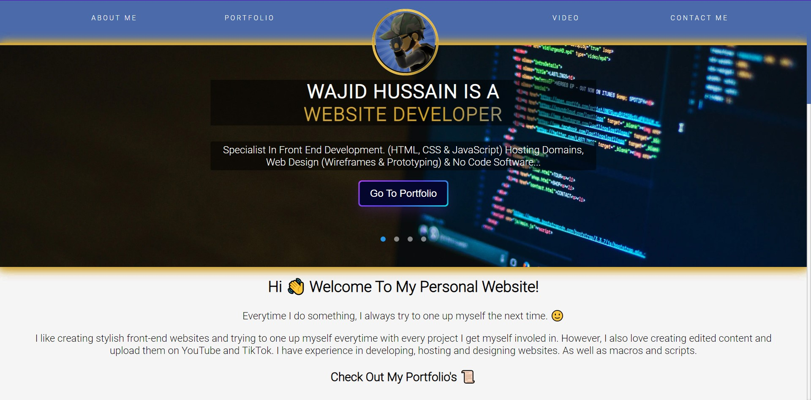
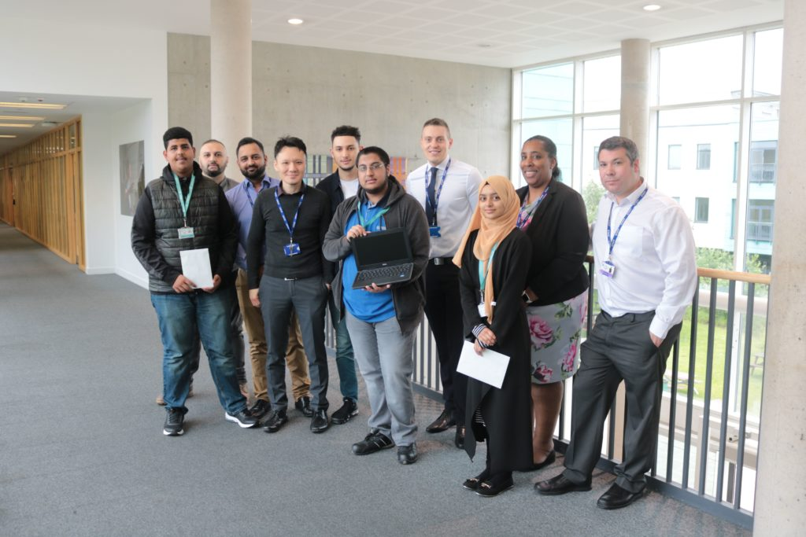

# 👋 Hello, I am Wajid...

Everytime I do something, I always try to one up myself the next time. 🙂 
 
My website that contains my CV portfolio. It's https://renlumfao.com/ - Check It Out!
  

> I like creating stylish front-end websites and trying to one up myself everytime with every project I get
> myself involed in. However, I also love creating edited content and upload them on YouTube.

I have experience in developing, hosting and designing websites. As well as macros and scripts. 
All My Repositories: https://github.com/MafiaDon2011?tab=repositories  
Python Repositorie: https://github.com/MafiaDon2011/Python-code 

Self-taught and talented with Adobe Photoshop in terms of manipulating, transforming and touching up image media and exporting files to the correct format necessary. Experienced with Video Pad Video Editor by NCH Software, a tool I use to create video media that I upload to my personal YouTube channel. Such skills include cutting video and stitching clips together, syncing audio, adding additional audio, adding effects such as text, zoom, transitions, changing the resolution and frame rate, then exporting them to the correct format necessary.

# Programming & IT specialist - obtaining IT Students of the Year Award from Joseph Chamberlain Sixth Form College.

 Wayback Machine Link: https://bit.ly/3Tl61Hn – I am the one holding the Chromebook in the middle.
 
>Here is what the IT staff had to say about me.  
>“Wajid consistently went above and beyond when completing all units to the highest of standards and is a well-deserved winner for student of the year prize”  
>Head of Department, Barbara, said,  
>“We’re really proud as a department with the consistently high standard of work from these students. Their efforts really stood out and they are truly deserving winners!”

# My Creative / Design Side

My designs in terms of wireframes, mock-ups and prototypes for desktop / mobile websites for training purposes and showcasing skills. 

Renlumfao & Netcom Training Design and Prototype Mockup 🔽 
 Sitemap & Wireframes: https://bit.ly/3dfaryR  
 Desktop Mockup & Prototype: https://bit.ly/3d93X4J & https://bit.ly/3vMfMUM  
 Mobile Mockup & Prototype: https://bit.ly/3QarOiX & https://bit.ly/3BQsF4b  

TMF Social Design Mockup 🔽 
 Desktop Mockup: https://bit.ly/3K57b7X 
Repository Link: https://bit.ly/3W4kXKb

I don't like to talk about my channels, but I'm proud of what I can acomplish on it.

 Check me out here: https://bit.ly/3P358Ql  
 Check me out here: https://bit.ly/3QCUgd8

I have also taken an interest in other languages and cultures thus I am self-teaching myself other languages from online
courses. This being “Learn to Speak, Understand and Read with Pimsleur Language Programs”. As well I use Duolingo to help learn and improve myself daily when learning Japanese.

 My Profile: https://bit.ly/3pbeC1z

# My Programming Experience
1. CSS (CSS3) | (5+ years)
2. HTML (HTML5) | (5+ years)
3. JavaScript (React.js, TypeScript.js, Vue.js, js) | (5+ years)
4. Python | (5+ years)
5. Java | (3+ years)
